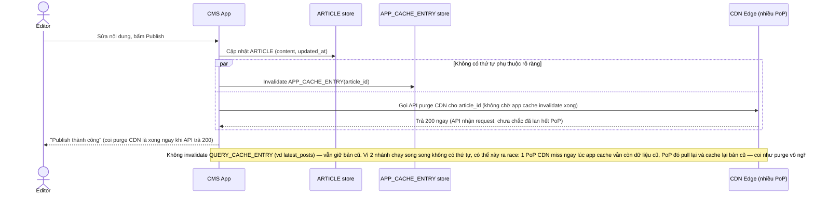

# Base sequence — Publish article (invalidation chưa đúng thứ tự)

Đây là **base**, flow "Biên tập viên sửa và publish lại bài viết" ở trạng thái hiện tại — chỉ invalidate application cache đúng, còn CDN thì bắn đi không chờ xác nhận và không theo thứ tự phụ thuộc. Flow này liên quan mật thiết tới enhance vì yêu cầu thứ 1 và 2 của đề bài chính là sửa lại đúng vấn đề thứ tự và xác nhận purge ở đây.

