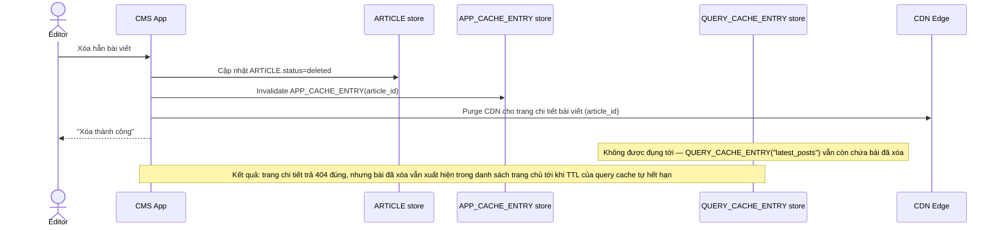

# Base sequence — Delete article (bỏ sót query cache)

Đây là **base**, flow "Xóa hẳn bài viết" ở trạng thái hiện tại — chỉ invalidate cache theo article_id, không đụng tới các query cache theo danh sách. Flow này liên quan mật thiết tới enhance vì yêu cầu thứ 3 của đề bài chính là sửa đúng lỗ hổng này.

