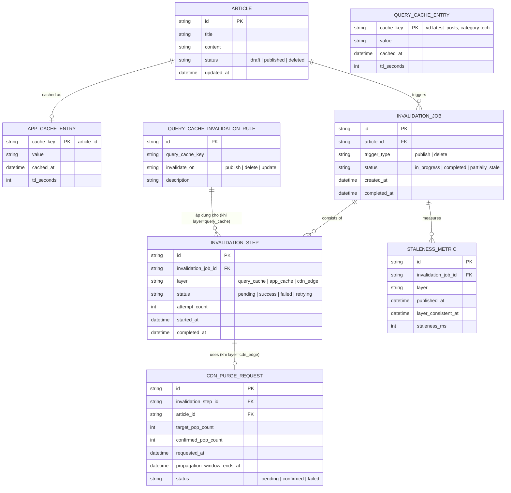

# Enhance ERD — sau khi có orchestration invalidation đa tầng

Đây là ERD **sau khi** enhance được áp dụng lên base. So với base, có 4 nhóm entity mới, ứng trực tiếp với 5 yêu cầu trong đề bài:

- `INVALIDATION_JOB` + `INVALIDATION_STEP` (mới) — điều phối invalidation theo đúng thứ tự (query cache → app cache → CDN), mỗi bước theo dõi trạng thái/retry riêng thay vì bắn song song như base.
- `CDN_PURGE_REQUEST` thêm `target_pop_count`/`confirmed_pop_count`/`propagation_window_ends_at` — chỉ coi purge hoàn tất khi đủ số PoP quan trọng xác nhận, không còn coi API trả 200 là xong ngay.
- `QUERY_CACHE_INVALIDATION_RULE` (mới) — khai báo rõ query cache nào (vd "latest_posts") phải bị invalidate khi có publish/delete, để không bỏ sót như base.
- `STALENESS_METRIC` (mới) — đo end-to-end staleness từ lúc publish tới lúc từng tầng phản ánh đúng nội dung mới.

