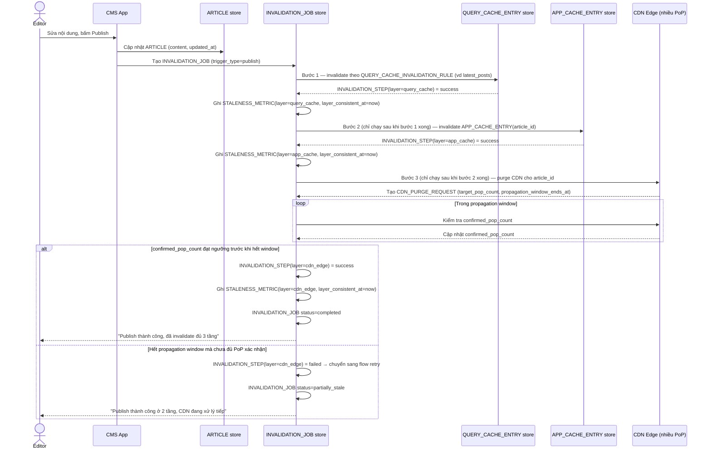

# Enhance sequence — Publish article (đúng thứ tự, có xác nhận CDN, đo staleness)

Đây là **enhance**, cùng flow "Publish article" đã có ở base nhưng nay thay đổi theo yêu cầu 1, 2 và 5 của đề bài: 3 tầng được invalidate theo đúng thứ tự phụ thuộc (query cache → app cache → CDN), CDN chỉ coi là xong khi đủ số PoP xác nhận trong propagation window, và mỗi tầng được đo staleness riêng.

