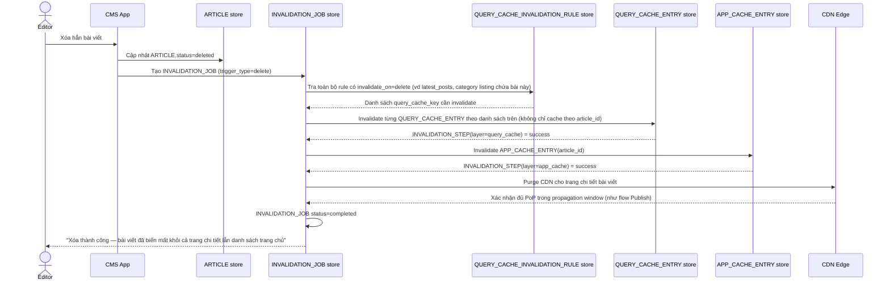

# Enhance sequence — Delete article (invalidate cả query cache dạng danh sách)

Đây là **enhance**, cùng flow "Delete article" đã có ở base nhưng nay thay đổi theo yêu cầu thứ 3 của đề bài: dùng `QUERY_CACHE_INVALIDATION_RULE` để xác định và invalidate đúng các query cache dạng danh sách (không chỉ cache theo article_id), đi theo cùng thứ tự query cache → app cache → CDN như flow publish.

