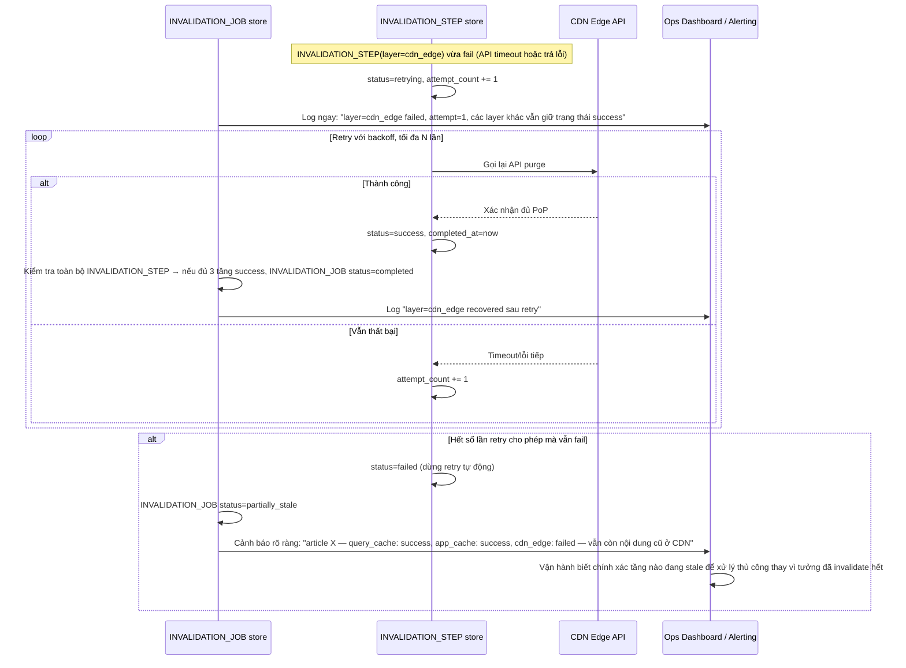

# Enhance sequence — Invalidation failure & retry

Đây là **enhance**, flow hoàn toàn mới, phát sinh từ enhance — chưa tồn tại ở base (ở base, purge CDN fire-and-forget, không ai biết nó có thất bại hay không). Đáp ứng yêu cầu thứ 4 của đề bài: khi 1 tầng invalidate thất bại (vd API purge CDN timeout), phải retry có theo dõi trạng thái và log rõ tầng nào thành công/thất bại.

