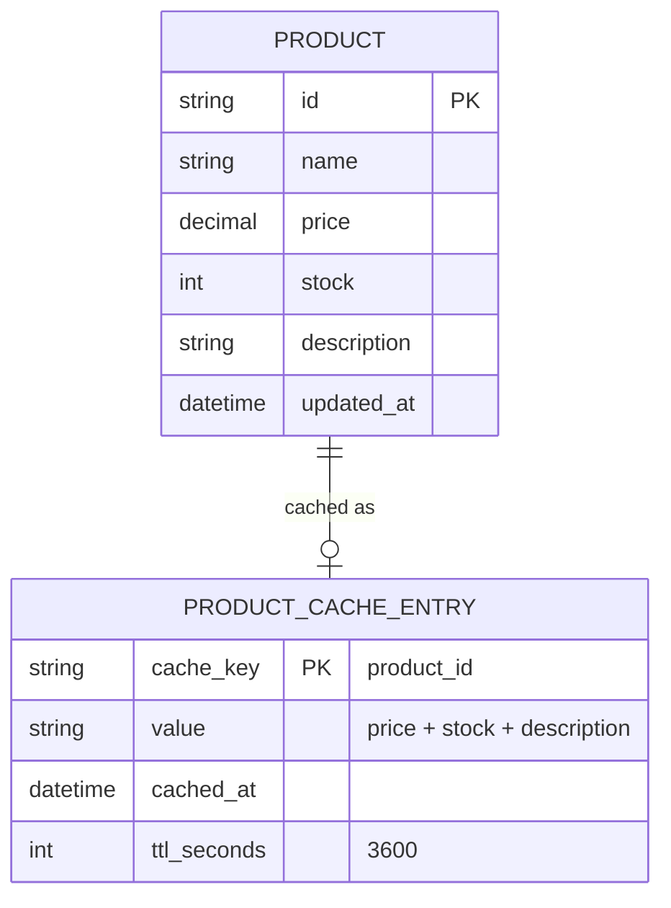

# Base ERD — Cache trang sản phẩm chỉ dựa vào TTL cố định

Đây là **base**: mô hình dữ liệu suy luận từ ngữ cảnh đề bài, thể hiện trạng thái hệ thống **trước khi** có invalidation theo event. Đề bài nói cache trang chi tiết sản phẩm (giá, tồn kho, mô tả) với TTL 1 giờ — nên base cần đủ: sản phẩm và 1 cache entry theo product_id với TTL cố định dài. Chưa có entity nào phục vụ invalidation theo event/khoá chống stampede/đo lường — những thứ đó là phần enhance.

