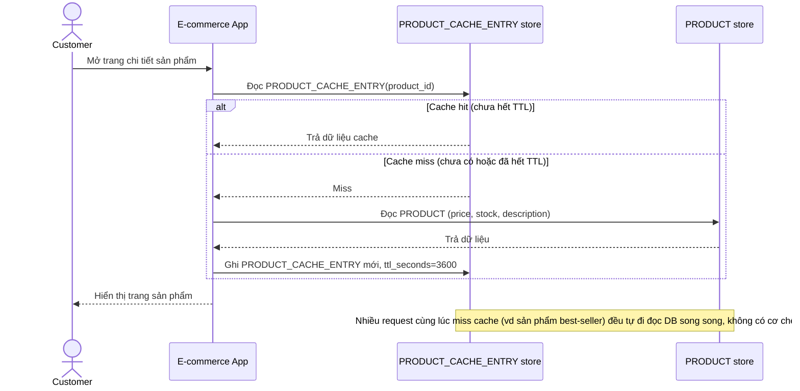

# Base sequence — View product page

Đây là **base**, flow "Xem trang chi tiết sản phẩm" — nền tảng cho enhance: cache chỉ dựa vào TTL cố định dài, nên khi dữ liệu gốc đổi giữa chừng, request đọc vẫn thấy dữ liệu cũ cho tới khi TTL tự hết hạn.

