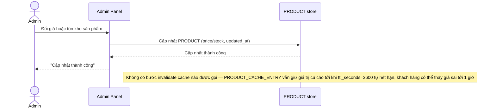

# Base sequence — Update product (chỉ dựa TTL, không invalidate)

Đây là **base**, flow "Admin đổi giá/tồn kho" ở trạng thái hiện tại — cập nhật DB xong là kết thúc, không đụng gì tới cache. Flow này liên quan mật thiết tới enhance vì toàn bộ 5 yêu cầu của đề bài đều nhằm sửa đúng lỗ hổng "chờ TTL" ở đây.

