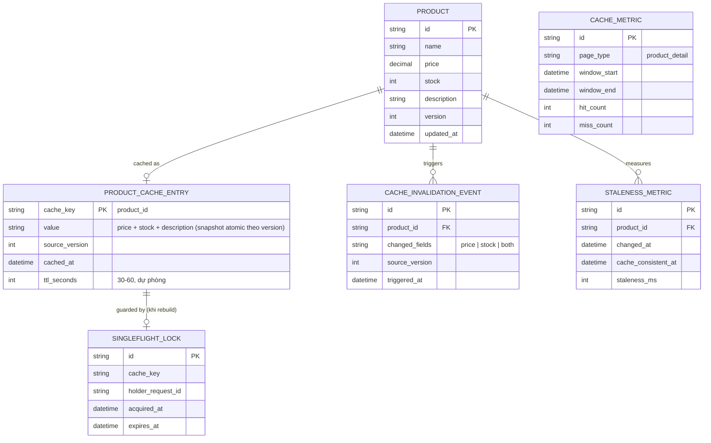

# Enhance ERD — sau khi có invalidation theo event + chống stampede

Đây là ERD **sau khi** enhance được áp dụng lên base. So với base, có 4 thay đổi chính, ứng trực tiếp với 5 yêu cầu trong đề bài:

- `PRODUCT` thêm `version` — dùng để xây snapshot cache atomic (giá + tồn kho cùng 1 version), tránh trạng thái nửa cũ nửa mới.
- `PRODUCT_CACHE_ENTRY` thêm `source_version` và `ttl_seconds` rút ngắn (dự phòng) — kết hợp cả invalidate theo event lẫn TTL ngắn thay vì chỉ dựa TTL dài như base.
- `CACHE_INVALIDATION_EVENT` (mới) — phát sinh ngay khi giá/tồn kho đổi, invalidate trong vài giây.
- `SINGLEFLIGHT_LOCK` (mới) — chỉ 1 request được rebuild cache khi miss, chống cache stampede.
- `CACHE_METRIC` + `STALENESS_METRIC` (mới) — đo hit ratio theo loại trang và độ trễ invalidate thực tế.

