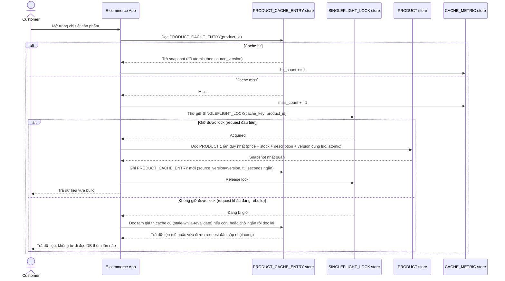

# Enhance sequence — View product page (atomic snapshot + chống stampede)

Đây là **enhance**, cùng flow "View product page" đã có ở base nhưng nay thay đổi theo yêu cầu 3 và 4 của đề bài: cache được đọc/ghi như 1 snapshot atomic theo `version` (không bao giờ thấy giá mới nhưng tồn kho cũ), và khi nhiều request cùng miss cache thì chỉ 1 request được rebuild (singleflight), số còn lại chờ hoặc dùng tạm dữ liệu cũ thay vì dội hết xuống DB.

