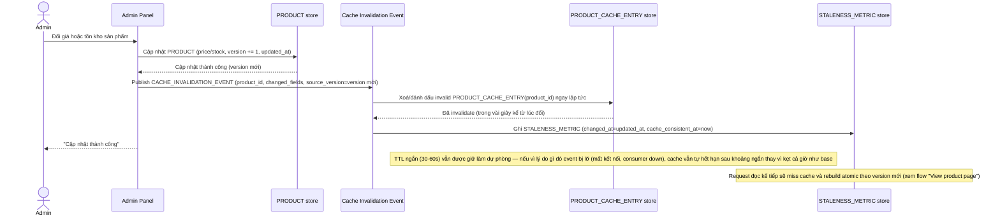

# Enhance sequence — Update product (invalidate theo event + TTL ngắn dự phòng + đo staleness)

Đây là **enhance**, cùng flow "Update product" đã có ở base nhưng nay thay đổi theo yêu cầu 1, 2 và 5 của đề bài: cập nhật giá/tồn kho phát ngay `CACHE_INVALIDATION_EVENT` để invalidate trong vài giây, kết hợp TTL ngắn dự phòng phòng khi event bị lỡ, và đo staleness thực tế.

