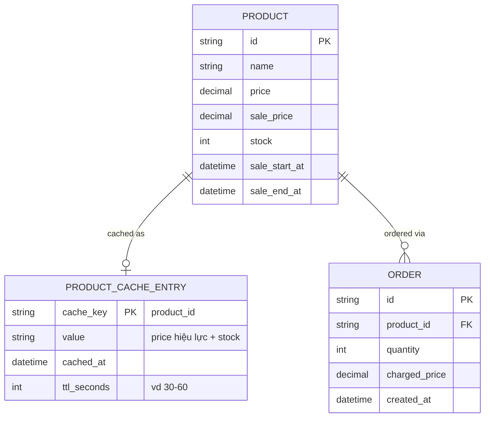

# Base ERD — Cache flash sale trước khi tối ưu cho tần suất thay đổi cực cao

Đây là **base**: mô hình dữ liệu suy luận từ ngữ cảnh đề bài, thể hiện trạng thái hệ thống **trước khi** có các cơ chế đặc thù cho flash sale. Đề bài nói flash sale đã có lịch giảm giá theo giờ và giá/tồn kho hiển thị dựa vào cache — nên base cần đủ: sản phẩm (kèm lịch sale), 1 cache entry chung cho giá+tồn kho với TTL cố định, và đơn hàng. Chưa có entity nào phục vụ invalidation chủ động theo đơn hàng/bypass cache khi sắp hết hàng/pre-warm theo lịch/double-check giá — những thứ đó là phần enhance.

