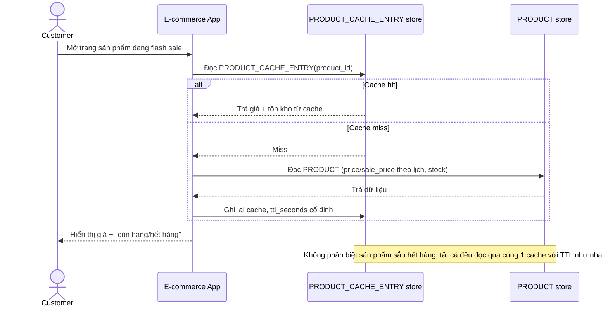

# Base sequence — View product page (TTL cố định, chưa tách stock riêng)

Đây là **base**, flow "Xem trang sản phẩm trong giờ flash sale" — dùng chung 1 cache entry cho cả giá lẫn tồn kho với TTL cố định, giống cache thông thường. Đây chính là điểm mà yêu cầu 1 và 2 của đề bài nhắm vào: tồn kho biến động quá nhanh so với TTL này.

