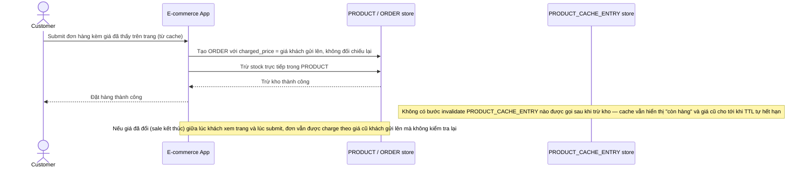

# Base sequence — Checkout (tin cache, không invalidate khi trừ kho)

Đây là **base**, flow "Đặt hàng" ở trạng thái hiện tại — backend tin thẳng giá khách nhìn thấy lúc submit, và trừ kho xong không chủ động invalidate cache. Flow này liên quan mật thiết tới enhance vì yêu cầu 1 và 4 của đề bài chính là sửa đúng 2 lỗ hổng ở đây.

