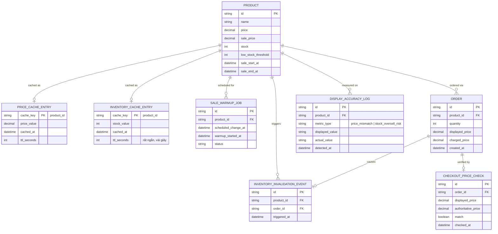

# Enhance ERD — sau khi tối ưu cache cho flash sale

Đây là ERD **sau khi** enhance được áp dụng lên base. So với base, có 5 thay đổi chính, ứng trực tiếp với 5 yêu cầu trong đề bài:

- Tách `PRICE_CACHE_ENTRY` và `INVENTORY_CACHE_ENTRY` riêng (thay vì gộp chung như base) — tồn kho cần TTL rất ngắn + invalidate chủ động, còn giá chủ yếu đổi theo lịch nên có thể pre-warm.
- `INVENTORY_INVALIDATION_EVENT` (mới) — phát sinh ngay khi có đơn hàng trừ kho.
- `PRODUCT` thêm `low_stock_threshold` — sản phẩm dưới ngưỡng này bỏ qua cache, đọc thẳng DB.
- `SALE_WARMUP_JOB` (mới) — pre-warm cache trước thời điểm đổi giá theo lịch vài giây, chống stampede.
- `CHECKOUT_PRICE_CHECK` (mới) — double-check giá ở backend trước khi charge.
- `DISPLAY_ACCURACY_LOG` (mới) — log các lần hiển thị sai giá/tồn kho để làm baseline đo lường.

