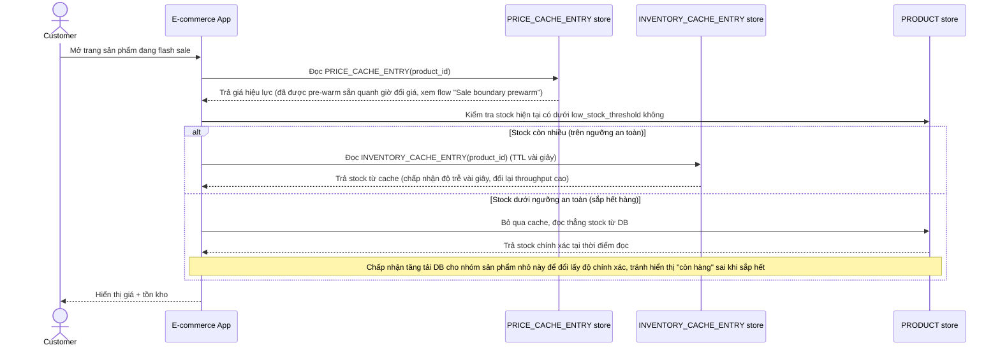

# Enhance sequence — View product page (tách cache, bypass khi sắp hết hàng)

Đây là **enhance**, cùng flow "View product page" đã có ở base nhưng nay thay đổi theo yêu cầu 1 và 2 của đề bài: tồn kho đọc qua `INVENTORY_CACHE_ENTRY` với TTL rất ngắn (giây), và sản phẩm dưới `low_stock_threshold` bỏ qua cache hoàn toàn để đảm bảo chính xác.

