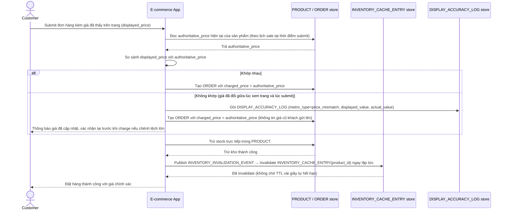

# Enhance sequence — Checkout (invalidate chủ động + double-check giá)

Đây là **enhance**, cùng flow "Checkout" đã có ở base nhưng nay thay đổi theo yêu cầu 1, 4 và 5 của đề bài: trừ kho xong invalidate ngay `INVENTORY_CACHE_ENTRY` thay vì chờ TTL, và backend đối chiếu lại giá thực tế tại thời điểm submit thay vì tin thẳng giá client gửi lên.

