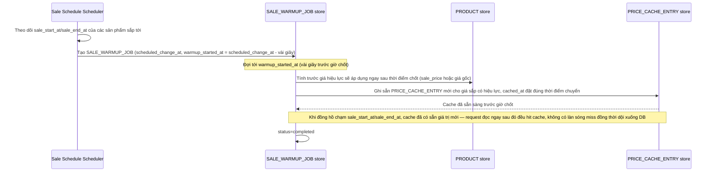

# Enhance sequence — Sale boundary prewarm

Đây là **enhance**, flow hoàn toàn mới, phát sinh từ enhance — chưa tồn tại ở base. Đáp ứng yêu cầu thứ 3 của đề bài: pre-warm cache trước thời điểm giờ flash sale bắt đầu/kết thúc vài giây, tránh hàng loạt cache cùng miss đồng thời đúng lúc chốt giờ (cache stampede).

