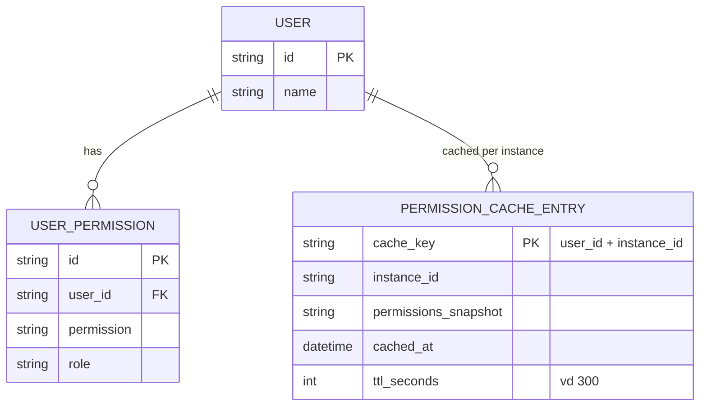

# Base ERD — Cache permission trước khi có broadcast invalidation

Đây là **base**: mô hình dữ liệu suy luận từ ngữ cảnh đề bài, thể hiện trạng thái hệ thống **trước khi** có cơ chế broadcast invalidation xuyên instance. Đề bài nói kiến trúc nhiều instance cùng cache permission cục bộ — nên base cần đủ: user, role/permission gán cho user, và cache entry permission theo từng instance với TTL cố định. Chưa có entity nào phục vụ broadcast/xác nhận/audit log invalidation — những thứ đó là phần enhance.

