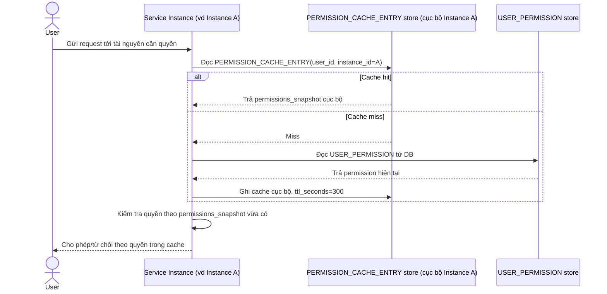

# Base sequence — Authorize request

Đây là **base**, flow "Kiểm tra quyền cho mỗi request" — nền tảng cho enhance: mỗi instance tự cache permission cục bộ, không biết gì về thay đổi quyền xảy ra ở nơi khác cho tới khi TTL của chính nó hết hạn.

