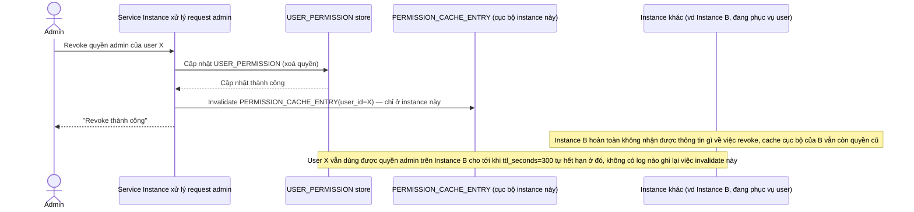

# Base sequence — Admin revoke permission (chỉ invalidate cục bộ)

Đây là **base**, flow "Admin revoke quyền của user" ở trạng thái hiện tại — chỉ invalidate cache ở đúng instance xử lý request revoke, các instance khác không hay biết gì. Flow này liên quan mật thiết tới enhance vì toàn bộ 5 yêu cầu của đề bài đều nhằm sửa đúng lỗ hổng bảo mật này.

