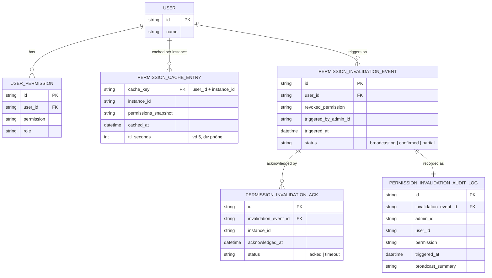

# Enhance ERD — sau khi có broadcast invalidation xuyên instance

Đây là ERD **sau khi** enhance được áp dụng lên base. So với base, có 3 nhóm entity mới, ứng trực tiếp với 5 yêu cầu trong đề bài:

- `PERMISSION_INVALIDATION_EVENT` (mới) — phát broadcast ngay khi có revoke, thay vì chỉ invalidate cục bộ như base.
- `PERMISSION_INVALIDATION_ACK` (mới) — theo dõi từng instance đã xác nhận invalidate hay chưa, đảm bảo lan tới toàn bộ instance.
- `PERMISSION_CACHE_ENTRY` giảm `ttl_seconds` xuống rất ngắn (dự phòng cho trường hợp broadcast thất bại một phần).
- `PERMISSION_INVALIDATION_AUDIT_LOG` (mới) — log đầy đủ ai revoke, quyền gì, khi nào, phục vụ audit an ninh.

