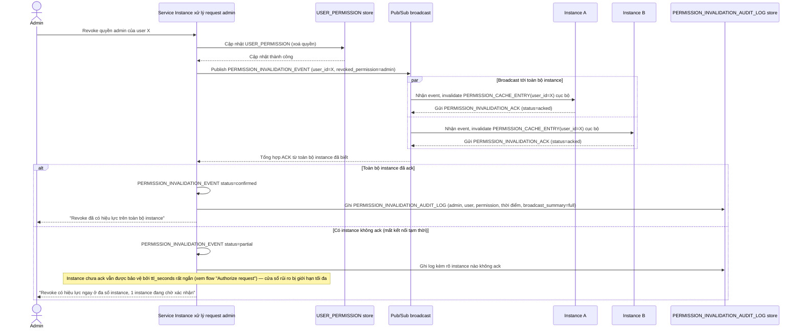

# Enhance sequence — Admin revoke permission (broadcast + ack + audit)

Đây là **enhance**, cùng flow "Admin revoke permission" đã có ở base nhưng nay thay đổi hoàn toàn theo yêu cầu 1, 2 và 5 của đề bài: broadcast invalidation tới toàn bộ instance qua pub/sub, chờ xác nhận trước khi coi revoke đã có hiệu lực đầy đủ, và log lại toàn bộ cho audit.

