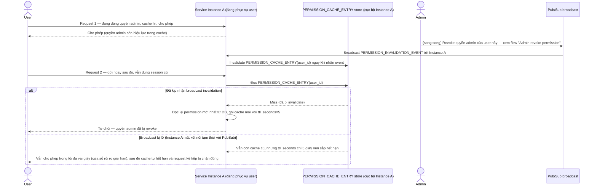

# Enhance sequence — Authorize request (test case: revoke giữa session đang hoạt động)

Đây là **enhance**, cùng flow "Authorize request" đã có ở base nhưng nay thay đổi theo yêu cầu 3 và 4 của đề bài: TTL dự phòng rất ngắn thay vì vài phút, và minh hoạ đúng test case bắt buộc — user đang có session hoạt động bị revoke quyền admin giữa chừng, request tiếp theo phải bị chặn đúng theo quyền mới.

