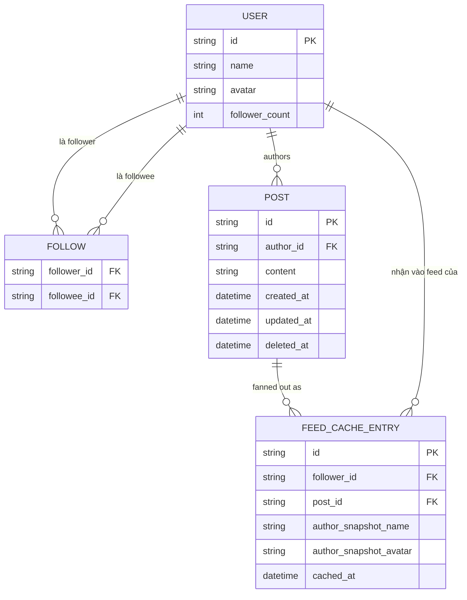

# Base ERD — Cache feed trước khi có chiến lược fan-out phân biệt

Đây là **base**: mô hình dữ liệu suy luận từ ngữ cảnh đề bài, thể hiện trạng thái hệ thống **trước khi** có chiến lược fan-out phân biệt theo quy mô follower. Đề bài nói cache feed lưu kèm snapshot tác giả (denormalized) và được fan-out cho follower — nên base cần đủ: user (kèm follower_count), quan hệ follow, bài viết, và feed cache entry theo từng follower (fan-out-on-write áp dụng đồng loạt, không phân biệt quy mô). Chưa có entity nào phục vụ version/ordering, chiến lược fan-out kép, hay đo staleness — những thứ đó là phần enhance.

