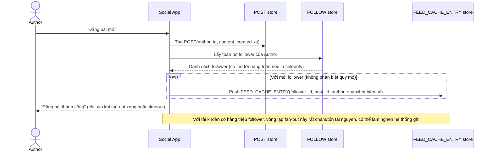

# Base sequence — Publish post (fan-out-on-write đồng loạt)

Đây là **base**, flow "Đăng bài mới" ở trạng thái hiện tại — fan-out-on-write cho toàn bộ follower, không phân biệt tài khoản có bao nhiêu follower. Flow này liên quan mật thiết tới enhance vì yêu cầu thứ 1 của đề bài chính là sửa đúng lỗ hổng "1 bài đăng làm invalidate hàng triệu cache feed cùng lúc" ở đây.

