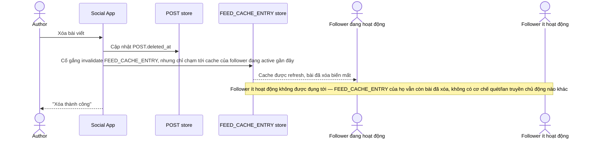

# Base sequence — Delete post (invalidate không đáng tin cậy)

Đây là **base**, flow "Xóa bài viết" ở trạng thái hiện tại — chỉ đụng tới cache của follower đang hoạt động, không chủ động lan tới toàn bộ. Flow này liên quan mật thiết tới enhance vì yêu cầu thứ 2 của đề bài chính là sửa đúng lỗ hổng "bài đã xóa vẫn hiển thị dai dẳng" ở đây.

