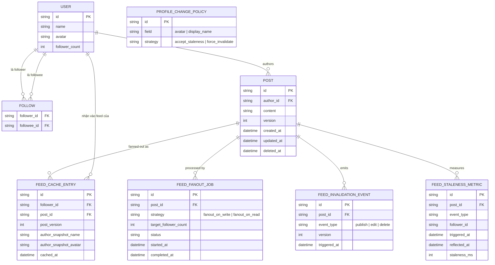

# Enhance ERD — sau khi có chiến lược fan-out kép + ordering + đo lường

Đây là ERD **sau khi** enhance được áp dụng lên base. So với base, có 5 thay đổi chính, ứng trực tiếp với 5 yêu cầu trong đề bài:

- `POST` và `FEED_CACHE_ENTRY` thêm `version`/`post_version` — đảm bảo thứ tự, tránh invalidate cũ đè lên update mới.
- `FEED_FANOUT_JOB` (mới) — ghi rõ mỗi bài dùng chiến lược `fanout_on_write` (follower ít) hay `fanout_on_read` (celebrity), thay vì đồng loạt như base.
- `FEED_INVALIDATION_EVENT` (mới) — mang theo version, dùng để lan truyền publish/edit/delete có thứ tự.
- `PROFILE_CHANGE_POLICY` (mới) — quyết định rõ chấp nhận staleness hay force invalidate khi đổi avatar/tên hiển thị.
- `FEED_STALENESS_METRIC` (mới) — đo độ trễ trung bình/p99 và tỉ lệ follower còn thấy nội dung cũ.

