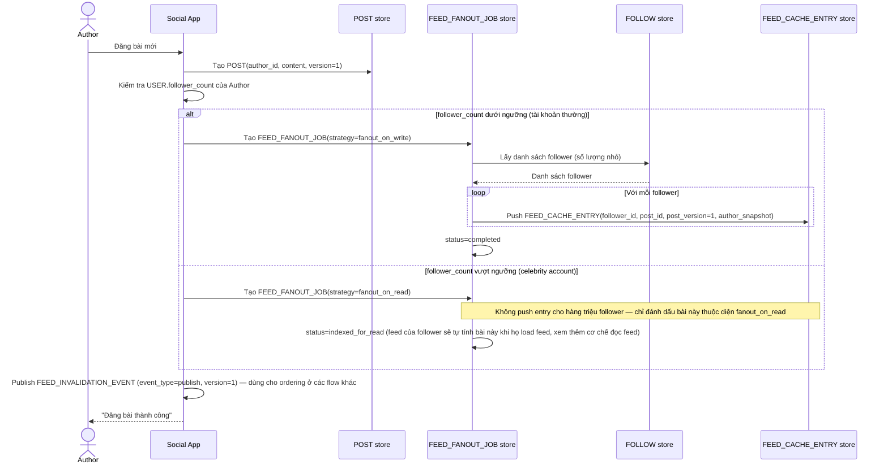

# Enhance sequence — Publish post (fan-out-on-write vs fan-out-on-read)

Đây là **enhance**, cùng flow "Publish post" đã có ở base nhưng nay thay đổi theo yêu cầu thứ 1 của đề bài: phân biệt chiến lược theo follower_count thay vì fan-out đồng loạt cho tất cả.

