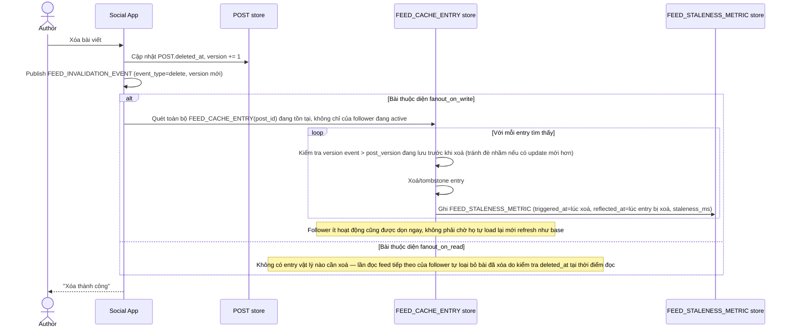

# Enhance sequence — Delete post (tombstone chủ động + đo staleness)

Đây là **enhance**, cùng flow "Delete post" đã có ở base nhưng nay thay đổi theo yêu cầu 2 và 5 của đề bài: chủ động quét và xoá entry ở toàn bộ follower thuộc diện fanout_on_write (không chỉ follower đang hoạt động), và đo lại staleness thực tế cho từng follower.

