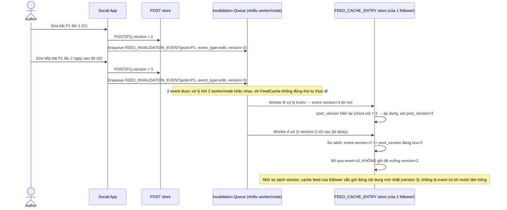

# Enhance sequence — Concurrent publish/edit ordering

Đây là **enhance**, flow hoàn toàn mới, phát sinh từ enhance — chưa tồn tại ở base (base không có cơ chế ordering nào). Đáp ứng yêu cầu thứ 3 của đề bài: 2 invalidation event cho cùng 1 bài tới cache theo thứ tự khác thứ tự thực tế (do khác hàng đợi/khác node xử lý), phải dùng version để tránh event cũ đè nhầm lên update mới.

