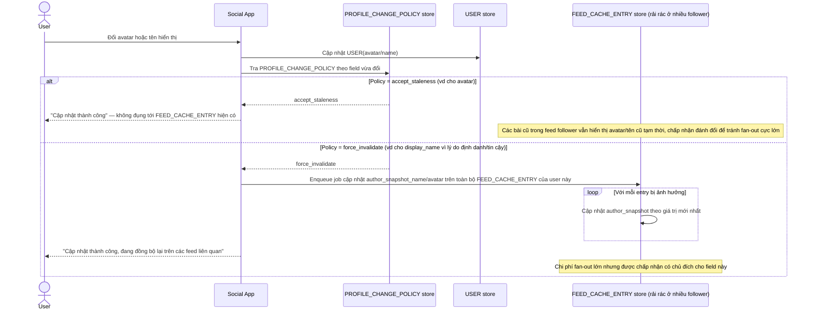

# Enhance sequence — Profile change propagation

Đây là **enhance**, flow hoàn toàn mới, phát sinh từ enhance — chưa tồn tại ở base (base không có quyết định rõ ràng nào cho trường hợp này). Đáp ứng yêu cầu thứ 4 của đề bài: khi đổi avatar/tên hiển thị, quyết định rõ chấp nhận staleness hay bắt buộc force invalidate toàn bộ snapshot cũ trong cache feed.

