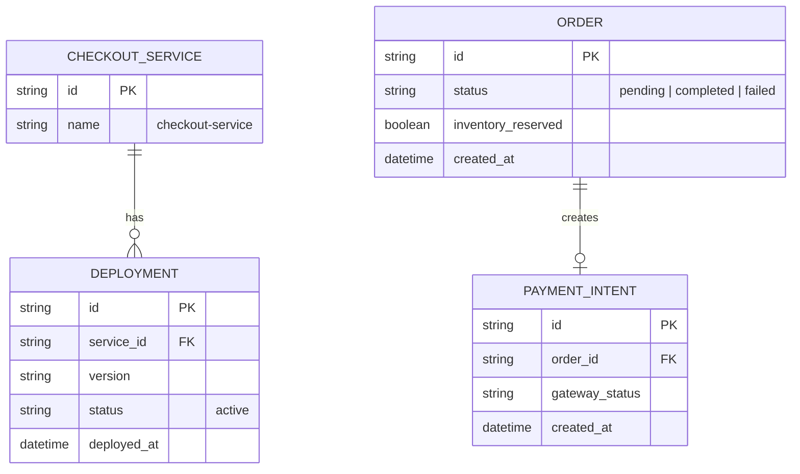

# Base ERD — Checkout service trước khi có canary

Đây là **base**: mô hình dữ liệu suy luận từ ngữ cảnh đề bài, thể hiện trạng thái hệ thống **trước khi** có canary deployment. Đề bài nói checkout tách riêng khỏi các service khác, xử lý thanh toán và có đơn hàng gắn tồn kho + payment intent — nên base cần đủ: service, deployment (chỉ 1 target đang chạy), đơn hàng, và payment intent. Chưa có entity nào phục vụ traffic split/metric riêng theo version/rollback policy — những thứ đó là phần enhance.

