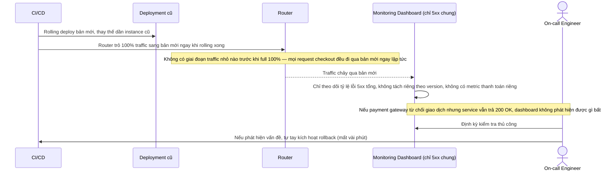

# Base sequence — Deploy (rolling trực tiếp, chưa có canary)

Đây là **base**, flow "Deploy checkout service" ở trạng thái hiện tại — đẩy thẳng 100% traffic sang bản mới, chỉ giám sát lỗi 5xx chung, rollback thủ công. Flow này liên quan mật thiết tới enhance vì toàn bộ 5 yêu cầu của đề bài đều nhằm cải tổ lại đúng flow deploy này cho riêng checkout.

