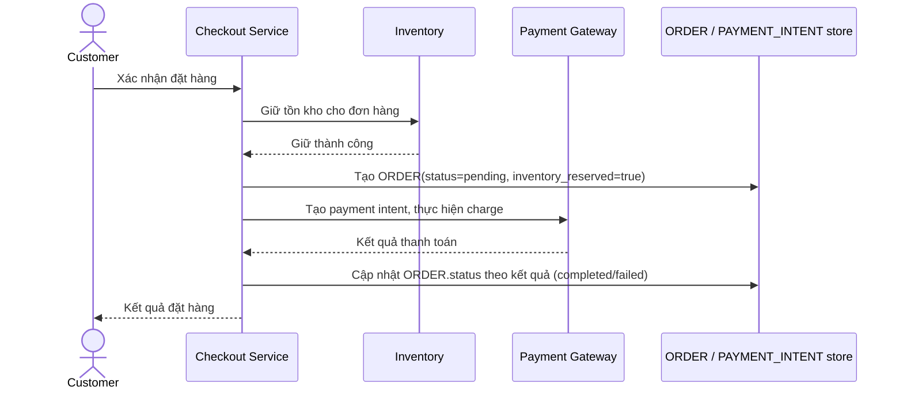

# Base sequence — Place order

Đây là **base**, flow "Đặt hàng/checkout" — nền tảng cho enhance: đơn hàng không gắn với version nào đã xử lý nó, nên khi có nhiều version chạy song song (canary), hệ thống chưa có cách xác định và xử lý nhất quán 1 đơn đang dở dang ở đúng version nào.

