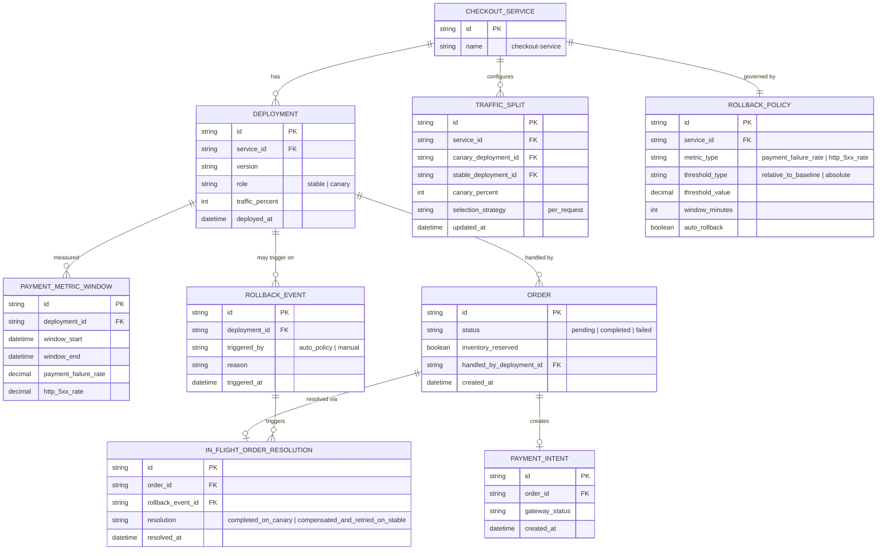

# Enhance ERD — sau khi có canary deployment cho checkout

Đây là ERD **sau khi** enhance được áp dụng lên base. So với base, có 5 thay đổi chính, ứng trực tiếp với 5 yêu cầu trong đề bài:

- `DEPLOYMENT` thêm `role` (stable/canary) và `traffic_percent`; `TRAFFIC_SPLIT` (mới) — chia traffic theo request, tăng dần từ tỷ lệ rất nhỏ, thay vì 100% ngay như base.
- `PAYMENT_METRIC_WINDOW` (mới) — đo riêng theo từng version, gần thời gian thực, gồm cả tỷ lệ thanh toán thất bại chứ không chỉ 5xx.
- `ROLLBACK_POLICY` + `ROLLBACK_EVENT` (mới) — tiêu chí rollback tự động cho ngưỡng nghiêm trọng, không chờ xác nhận thủ công.
- `ORDER` thêm `handled_by_deployment_id` — biết chính xác đơn nào đang dở dang ở canary khi rollback xảy ra.
- `IN_FLIGHT_ORDER_RESOLUTION` (mới) — xử lý nhất quán các đơn dở dang trên canary lúc rollback.

