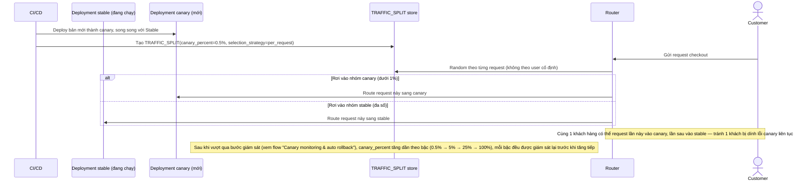

# Enhance sequence — Deploy (canary theo request, tăng dần)

Đây là **enhance**, cùng flow "Deploy" đã có ở base nhưng nay thay đổi hoàn toàn theo yêu cầu thứ 1 của đề bài: canary chỉ nhận dưới 1% traffic ban đầu, chọn ngẫu nhiên theo từng request chứ không cố định theo user, và chỉ tăng dần khi các bước trước đó ổn định.

