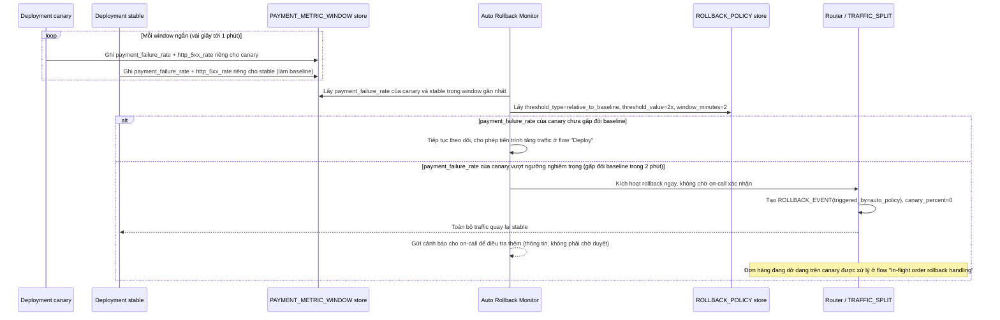

# Enhance sequence — Canary monitoring & auto rollback

Đây là **enhance**, flow hoàn toàn mới, phát sinh từ enhance — chưa tồn tại ở base (base chỉ có dashboard 5xx chung, kiểm tra thủ công). Đáp ứng yêu cầu 2, 4 và 5 của đề bài: metric riêng cho thanh toán (không chỉ 5xx), đo theo từng version gần thời gian thực, và rollback tự động cho ngưỡng nghiêm trọng mà không chờ người trực ca.

