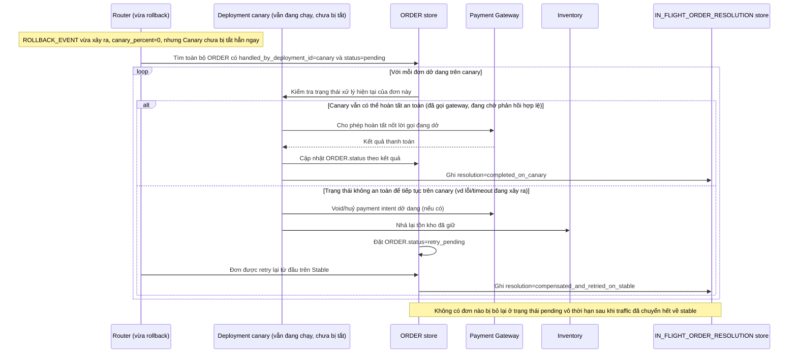

# Enhance sequence — In-flight order rollback handling

Đây là **enhance**, flow hoàn toàn mới, phát sinh từ enhance — chưa tồn tại ở base (base không có khái niệm "đơn dở dang trên 1 version cụ thể"). Đáp ứng yêu cầu thứ 3 của đề bài: đơn hàng đã bắt đầu ở canary (đã giữ tồn kho, đã tạo payment intent) nhưng canary bị rollback giữa chừng phải được hoàn tất hoặc hoàn tác nhất quán, không để treo dở dang.

