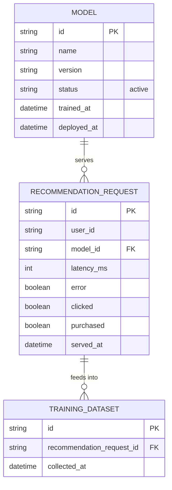

# Base ERD — Serving mô hình gợi ý trước khi có canary theo business metric

Đây là **base**: mô hình dữ liệu suy luận từ ngữ cảnh đề bài, thể hiện trạng thái hệ thống **trước khi** có canary đánh giá theo business metric. Đề bài nói hệ thống gợi ý serving real-time và có click/mua hàng — nên base cần đủ: model, request gợi ý (chỉ log metric kỹ thuật), và dataset huấn luyện gộp chung mọi request không phân biệt model nào đã serving. Chưa có entity nào phục vụ business metric theo model/policy đánh giá/gắn nhãn dữ liệu train — những thứ đó là phần enhance.

