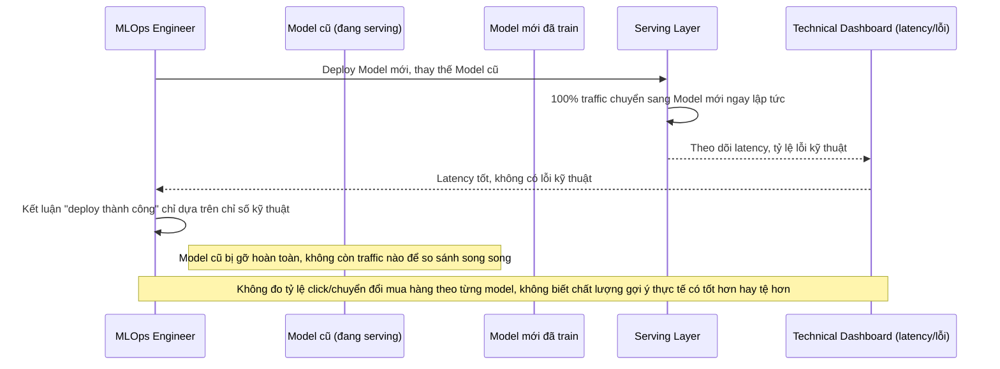

# Base sequence — Deploy model (thay thế trực tiếp, chỉ đo kỹ thuật)

Đây là **base**, flow "Thay model mới" ở trạng thái hiện tại — chuyển thẳng 100% traffic, chỉ xét ổn định kỹ thuật. Flow này liên quan mật thiết tới enhance vì toàn bộ 5 yêu cầu của đề bài đều nhằm cải tổ lại đúng flow này.

