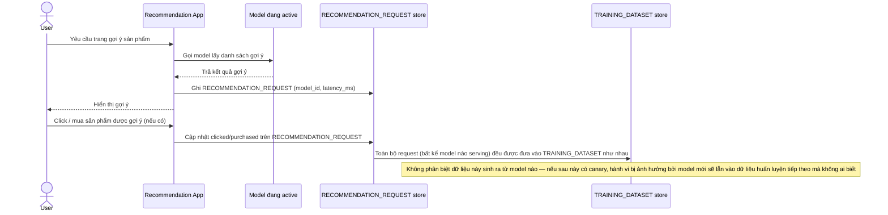

# Base sequence — Serve recommendation

Đây là **base**, flow "Serving gợi ý cho user" — nền tảng cho enhance: dữ liệu tương tác (click/mua) được gộp thẳng vào tập huấn luyện mà không đánh dấu model nào đã ảnh hưởng tới hành vi đó, tạo rủi ro feedback loop khi có nhiều model chạy song song sau này.

