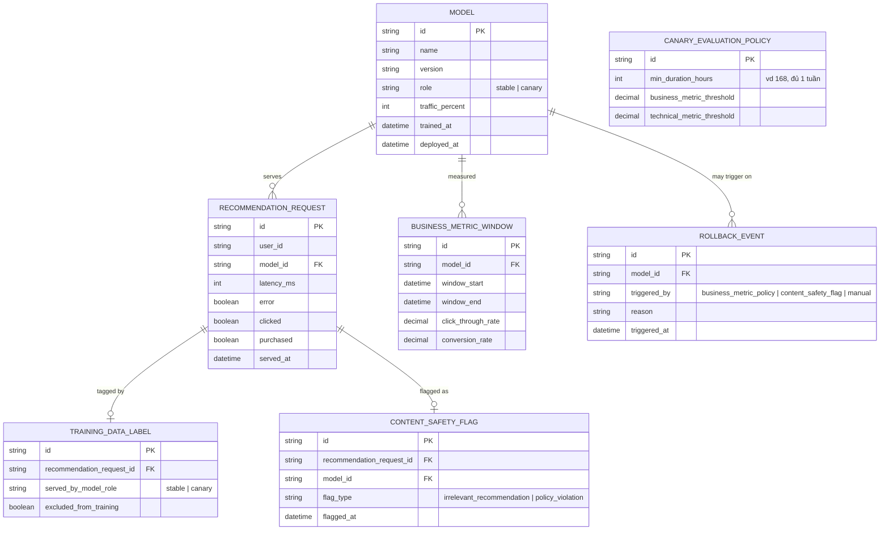

# Enhance ERD — sau khi có canary đánh giá theo business metric

Đây là ERD **sau khi** enhance được áp dụng lên base. So với base, có 4 nhóm entity mới, ứng trực tiếp với 5 yêu cầu trong đề bài:

- `MODEL` thêm `role`/`traffic_percent` — chạy song song stable/canary thay vì thay thế trực tiếp.
- `BUSINESS_METRIC_WINDOW` (mới) — đo CTR/conversion rate riêng theo từng model, không chỉ latency/lỗi.
- `CANARY_EVALUATION_POLICY` (mới) — quy định thời gian canary tối thiểu (đủ dài qua cả ngày thường lẫn cuối tuần) và ngưỡng business metric để kết luận.
- `TRAINING_DATA_LABEL` (mới) — gắn nhãn request theo model đã serving, tránh feedback loop khi train tiếp.
- `CONTENT_SAFETY_FLAG` + `ROLLBACK_EVENT` (mới) — rollback tức thời khi phát hiện gợi ý bất thường/vi phạm chính sách, không chờ phân tích metric dài hạn.

