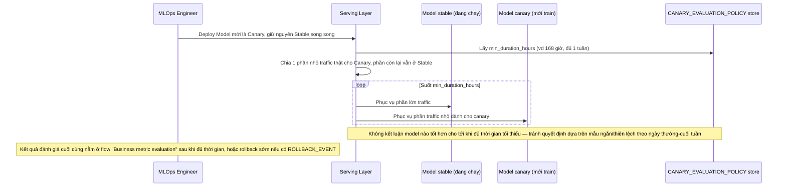

# Enhance sequence — Deploy model (canary song song, đủ thời gian đánh giá)

Đây là **enhance**, cùng flow "Deploy model" đã có ở base nhưng nay thay đổi theo yêu cầu 1 và 4 của đề bài: model mới chạy song song với model cũ trên 1 phần traffic thật, và canary phải chạy đủ lâu (qua cả ngày thường lẫn cuối tuần) trước khi kết luận.

