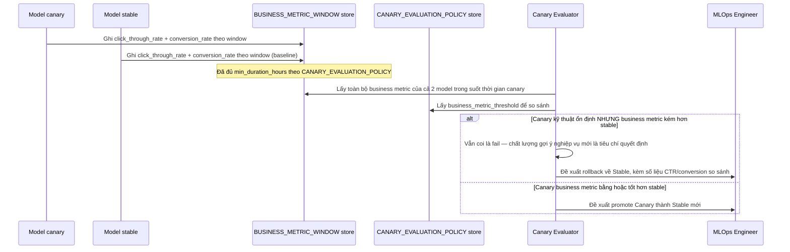

# Enhance sequence — Business metric evaluation

Đây là **enhance**, flow hoàn toàn mới, phát sinh từ enhance — chưa tồn tại ở base (base chỉ có dashboard kỹ thuật). Đáp ứng yêu cầu 1 và 2 của đề bài: so sánh CTR/conversion rate giữa canary và stable, và coi chất lượng gợi ý kém hơn về nghiệp vụ là tiêu chí rollback dù kỹ thuật hoàn toàn ổn định.

