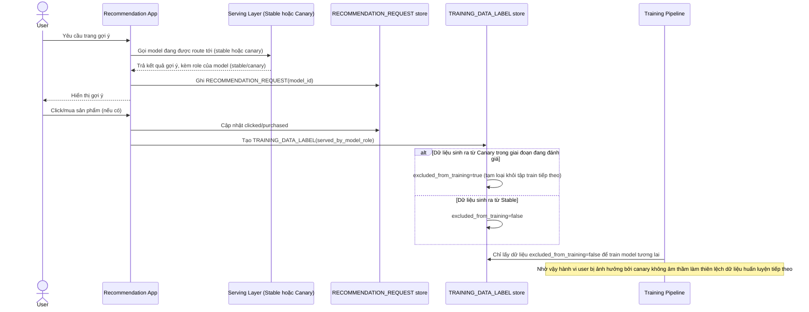

# Enhance sequence — Training data feedback-loop guard

Đây là **enhance**, cùng flow "Serve recommendation" đã có ở base nhưng nay thay đổi theo yêu cầu thứ 3 của đề bài: gắn nhãn rõ dữ liệu tương tác theo model nào đã serving, tránh dữ liệu bị ảnh hưởng bởi canary lẫn vào train model tương lai một cách không kiểm soát.

