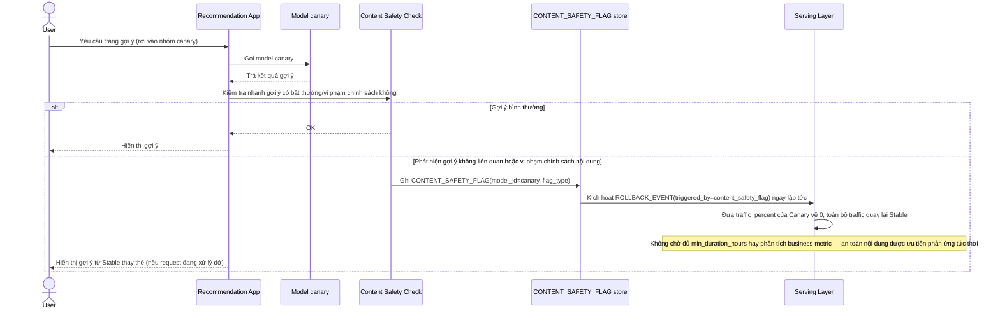

# Enhance sequence — Instant content-safety rollback

Đây là **enhance**, flow hoàn toàn mới, phát sinh từ enhance — chưa tồn tại ở base. Đáp ứng yêu cầu thứ 5 của đề bài: rollback tức thời khi phát hiện gợi ý bất thường/vi phạm chính sách, không cần chờ chu kỳ đánh giá business metric dài hạn như flow "Business metric evaluation".

