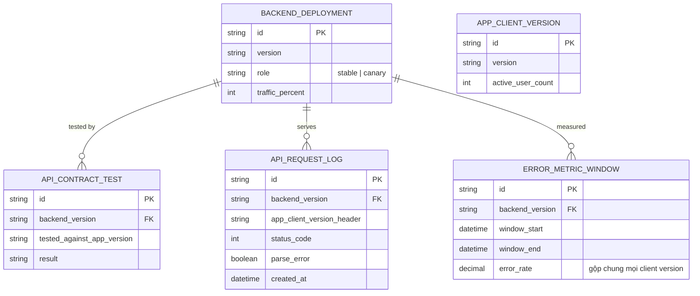

# Base ERD — Canary backend mobile trước khi nhận diện đa phiên bản app

Đây là **base**: mô hình dữ liệu suy luận từ ngữ cảnh đề bài, thể hiện trạng thái hệ thống **trước khi** canary nhận diện đa phiên bản app client. Đề bài nói backend đã phục vụ nhiều phiên bản app cũ và có sẵn khái niệm canary — nên base cần đủ: phiên bản app client, backend deployment (đã có role stable/canary), test hợp đồng API (chỉ test với app mới nhất), và log request (có ghi app_client_version_header nhưng chưa dùng để tách metric). Chưa có entity nào phục vụ stratify traffic theo version/metric tách theo version/kế hoạch rollback tương thích ngược — những thứ đó là phần enhance.

