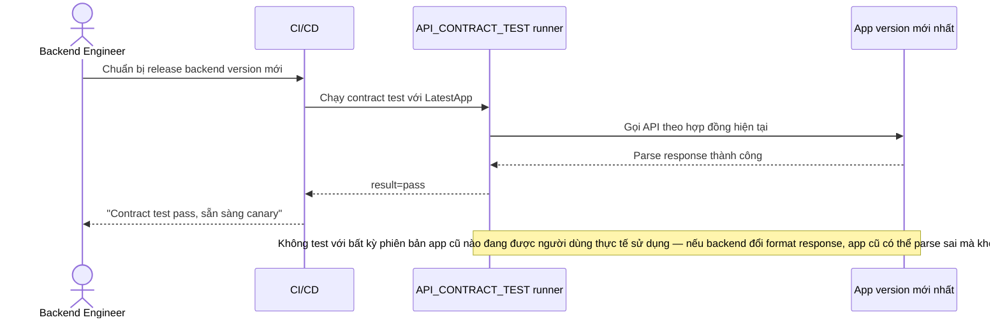

# Base sequence — Pre-release contract test (chỉ test app mới nhất)

Đây là **base**, flow "Test hợp đồng API trước khi canary" ở trạng thái hiện tại — chỉ test với phiên bản app mới nhất. Flow này liên quan mật thiết tới enhance vì yêu cầu thứ 1 của đề bài chính là sửa đúng lỗ hổng này.

